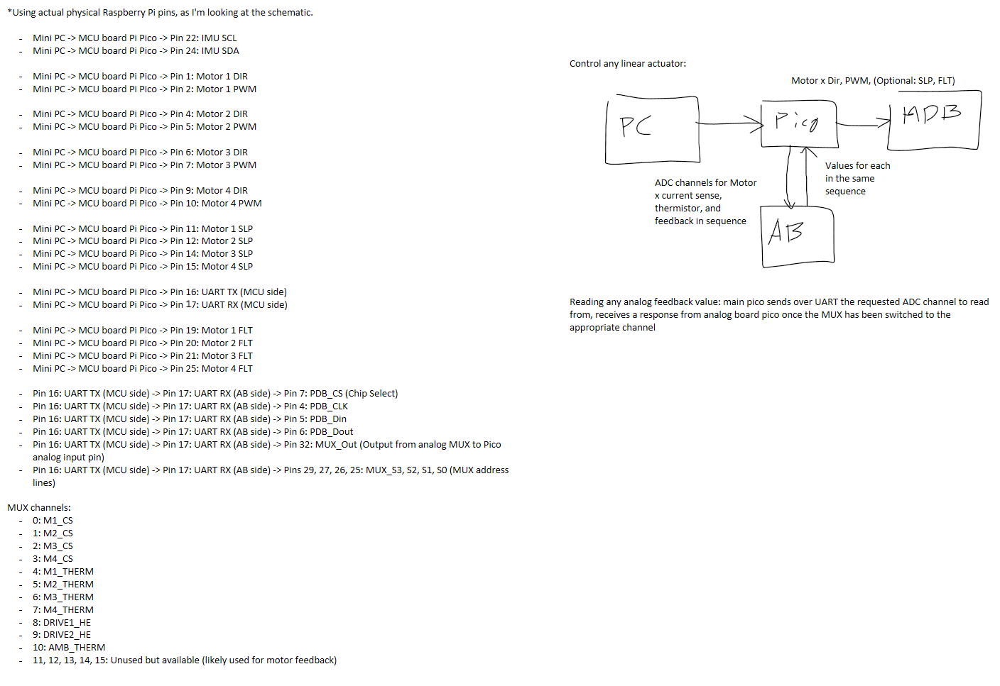

# Embedded Firmware

## System Layout

This includes all pin assignments and connections for the embedded system.

## Design Summary

There are 2 Raspberry Pi Picos that make up the embedded system. The Prime Pico is the main controller and communicates with the host computer via USB. The Secondary Pico is a smaller controller that communicates with the Prime Pico via UART. The Secondary Pico is responsible for reading the analog sensors and sending the data to the Prime Pico. The Prime Pico is responsible for controlling the motors and sending the data to the host computer.

## Build and Flash

`cargo run --bin pico-prime`

`cargo run --bin pico-secondary`
